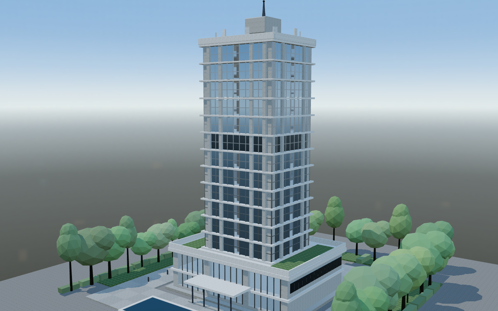

# threejs-modern-architecture

用 Three.js 做「现代建筑生长 / 逐层建造」动画的可复用工程套路。一栋 12 层镜面玻璃塔楼从场地平整开始逐层长出来，可自由环视、支持一天四时切换。

## 最终效果



## 核心思路

一句话记住：**构件永远不透明、永远实体，只做位移；整个场景只有一个 `progress` 标量驱动。**

| 难题 | 解法 |
| --- | --- |
| 一栋楼有几千个构件（楼板带 / 竖梃 / 玻璃扇 / 立柱），逐个 Mesh 直接拖垮帧率 | **按材质合批**：同材质的几百块几何合并成一个 Mesh，每材质 1 个 draw call |
| 想让每块构件「自己飞到位」，又不能用 opacity 淡入（会变成溶解而不是施工） | **把时序烘进顶点属性**：`aBuild=(start,duration,lift)` + `aOffset=方向`，在顶点着色器里做位移，全程不透明、始终实体 |
| 玻璃要反光，但镜面反射需要环境贴图 | **程序化 equirect 天空 → PMREM**：一条硬地平线＋太阳斑，这是玻璃能读作玻璃的唯一原因 |

## 目录结构

```
assets/
  starter/        自包含的起步工程（Vite + React + Three.js，无外部资源、无 API key）
  preview/        实拍截图（同一栋楼、多个机位与时刻）
references/       工程套路细节文档（材质体系 / 营造原则 / 验证 / 模板指南）
scripts/          scaffold.mjs（脚手架）、shoot.sh（本地视觉验证）
SKILL.md          完整的 skill 说明
```

## 跑起来

```sh
cd assets/starter
npm ci
npm run dev       # 127.0.0.1:5173
npm run build     # tsc --noEmit && vite build
npm run preview   # 预览生产构建
```

需要 Node.js 22.13+。

## 起步工程做了什么

| 机制 | 位置 |
| --- | --- |
| 按材质合批，每材质 1 个 draw call（1,599 块构件 → 18~29 个 draw call） | `assets/starter/src/structure/builder.ts` |
| 把建造时序烘进顶点属性的生长着色器（`aBuild` / `aOffset`） | `builder.ts` `inject()` |
| 逐构件 emissive 爬升，「灯光依次点亮」由建成状态直接驱动 | `builder.ts` + `tower.ts` `PHASE.lighting` |
| 一天四时预设：天空 stop + 五盏灯 + 曝光 + 室内灯光系数，换时只换 PMREM 不重建几何 | `structure/daylight.ts` + `TowerScene.tsx` `applyTime()` |
| 程序化 equirect 天空 → PMREM，同时当 `scene.background` | `materials.ts` `createSkyEnvironment()` |
| 清水混凝土板缝与拉杆孔、白色幕墙分缝、铝型材拉丝 | `materials.ts` |
| 每层三段式（楼板 → 竖梃 → 玻璃）、幕墙按方位角波次合拢 | `tower.ts` `storey()` |
| InstancedMesh 植被 + 逐实例生长 + 顶点风摆 | `structure/vegetation.ts` |
| 需求渲染 + 30 Hz 阴影节流 | `TowerScene.tsx` |

更多细节见 `SKILL.md` 与 `references/`。
